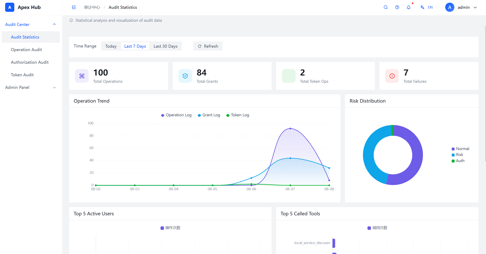
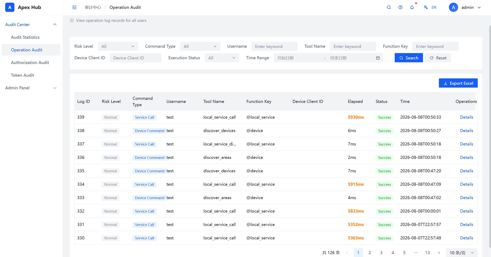
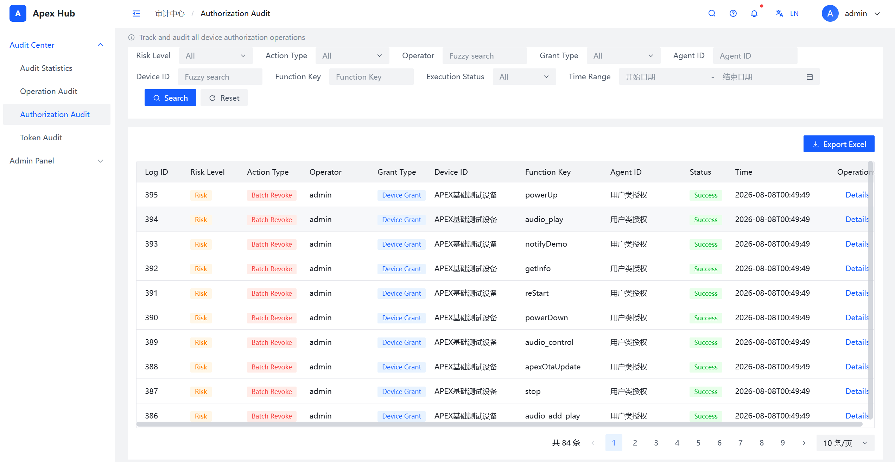
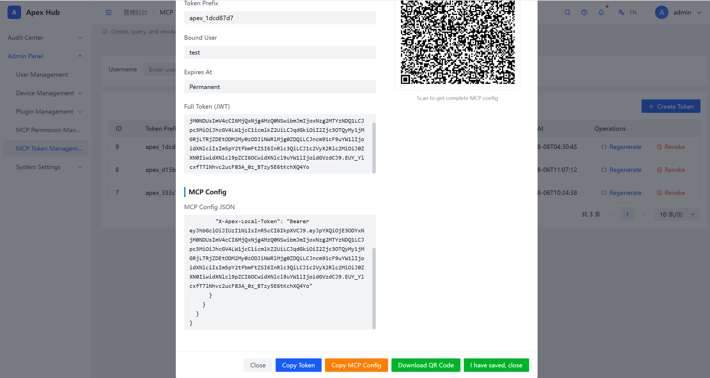
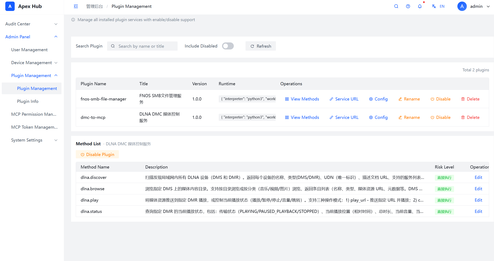
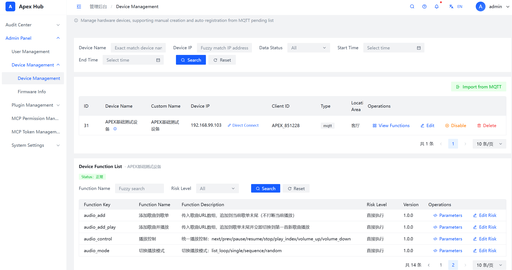

<!--
  ┌──────────────────────────────────────────────────────┐
  │  apex-mcp-bridge — AI-Native Edge MCP Controller    │
  │  Production documentation (2026-07-31).              │
  └──────────────────────────────────────────────────────┘
-->
<p align="center">
  
  
  
  
  
</p>

<p align="center">
  <b>Rust</b> · MCP · MQTT · Docker · Plugin Engine · ESP32
</p>

# Apex MCP Bridge

> **AI-Native Edge MCP Controller** — The core control layer that bridges AI agents to the physical world.

<div align="center">
<table>
<tr>
<td align="center"><br>💎 Data Overview</td>
<td align="center"><br>📋 Operation Audit</td>
<td align="center"><br>🔐 Authorization Audit</td>
</tr>
<tr>
<td align="center"><br>📱 Token QR Code</td>
<td align="center"><br>🔌 Plugin Management</td>
<td align="center"><br>🖧 Device Management</td>
</tr>
</table>
</div>

> � **中文文档 (Chinese)**: 完整的中文项目介绍请见 [README_ZH.md](./README_ZH.md) · 详细项目文档 [项目介绍.md](./docs/项目介绍.md)

**Apex MCP Bridge** is an AI-native edge hub that serves as the **core control layer** for AI agents to access the physical world. It connects all MCP-compatible agent clients (TRAE, WorkBuddy, Codex, Claude Code, Cursor, etc.) on one side, and all physical devices and network services (lights, speakers, robot dogs, NAS, printers, databases, ERPs, etc.) on the other — acting as a **unified MCP smart controller**.

Deployed via Docker, it runs on any Docker-capable device (NAS, servers, Raspberry Pi, PCs) with zero hardware dependency.

<details>
<summary><b>📋 Table of Contents</b></summary>

- [Key Highlights](#key-highlights) — Tool convergence, plugin framework, 5-layer security
- [Core Philosophy](#core-philosophy-brain-vs-hand-zero-trust-architecture) — Brain vs. hand, zero-trust
- [Why Apex MCP Bridge](#why-apex-mcp-bridge) — Value for developers
- [Architecture](#architecture) — System diagram & data flow
- [Quick Start](#quick-start) — Docker deployment, config, access
- [Plugin Installation](#plugin-installation) — MCP-ize network services
- [Core Features](#core-features) — 5-layer security, tool convergence
- [Related Projects](#related-projects) — Plugin repo, hardware frameworks
- [Security Notice](#security-notice) — Passwords, plugins, network
- [Contributing](#contributing) — How to contribute
- [FAQ](#faq) — Frequently asked questions

</details>

---

## 💎 Key Highlights

| 🎯 Tool Convergence (Save Tokens) | 🔌 Plugin Framework (No Reinventing) | � 5-Layer Security (Zero-Trust) |
|:---:|:---:|:---:|
| N devices + M services → agents see only **1 tool** | Dual open-source frameworks, AI constrained generation | Token + Permission + TTL + Anti-Bypass + Rate Limit |
| Constant token cost, hallucination risk slashed | Describe needs → get firmware/plugins, skip boilerplate | What AI can't see, it can never touch |

> **One-line pitch**: Tool convergence cuts costs + plugin framework boosts efficiency + zero-trust ensures safety — all through a single MCP entry.

---

## 🧠 Core Philosophy: Brain vs. Hand, Zero-Trust Architecture

**In one sentence: Agents think, Bridge acts, Humans authorize.**

> **The essence**: Bridge packages your local device services and network services into a single MCP Server. Users simply scan a QR code to connect their agent, and can then orchestrate data and devices within their authorized scope.

**Example**: You say "I want to listen to music" — the agent first calls a network service to fetch the music file, then calls a device service to play it on the speaker. Fully MCP-native, fully audited.

| Role | Responsibility | Has | Does NOT have |
|:---:|---|---|---|
| 🤖 Agent | Generates intent | Brain (reasoning) | Any keys or permissions |
| ✋ Bridge | Validate + Execute + Audit | Device & service control | Brain (never decides on its own) |
| 👤 Human | Defines authorization boundaries | Final decision authority | — |

> **Zero-trust principle**: Validate first, execute second, audit everything. Trust no agent by default.

---

## ✨ Why Apex MCP Bridge

### Value for Developers

| Pain Point | Bridge's Solution |
|---|---|
| N devices + M services = N+M MCP tools flooding context, token explosion | **Tool convergence**: all services converge to 1 MCP entry, constant token cost |
| Rewriting auth, permissions, MQTT stack for every project | **Dual open-source frameworks**: hardware (ESP32-S3/C3) + plugin engine (MIT), framework constraints + AI generation |
| Worried about AI hallucination causing misoperations | **5-layer security**: unauthorized devices/features are completely invisible to agents |
| Data compliance concerns (GDPR) | **Pure local architecture**: data never leaves LAN, Rust core for high performance & low footprint |

> AI agents learned to act, but no one installed a **safety gate** for them. Apex MCP Bridge is that gate.

The "Lobster Incident" in early 2026 saw 270,000 AI agent instances online simultaneously — deleting emails, leaking privacy, and getting scanned across the public internet. If this happens in an enterprise scenario: doors opened by any AI, robotic arms controlled by unauthorized commands, marketing agents accessing R&D data — the consequences are unbearable.

Apex MCP Bridge provides:

| Problem | Solution |
|---------|----------|
| No access control for AI agents | **Five-layer security** — token + permission + TTL + anti-bypass + rate limiting |
| N devices + M services = N+M MCP tools flooding the context | **Tool convergence** — all services converge to **1 MCP entry**, token-based permission filtering |
| High barrier to connect devices & services | **Dual open-source frameworks** — hardware (ESP32-S3/C3) + plugin engine, generate code via AI agents |
| Data privacy & compliance concerns | **Pure local architecture** — data never leaves the LAN, GDPR-ready |

---

## 🏗️ Architecture

```
┌─────────────────────────────────────────────────────────────────┐
│                        AI Agent Clients                           │
│   (TRAE · WorkBuddy · Claude Code · Cursor · Codex · ...)      │
└─────────────────────────────┬───────────────────────────────────┘
                              │ MCP Protocol
                              ▼
┌─────────────────────────────────────────────────────────────────┐
│                    Apex MCP Bridge (Rust)                        │
│  ┌─────────────┐  ┌─────────────┐  ┌─────────────────────────┐ │
│  │ 5-Layer     │  │  Tool       │  │  MCP ↔ MQTT / Plugin    │ │
│  │ Security    │  │  Convergence│  │  Protocol Translation    │ │
│  └─────────────┘  └─────────────┘  └─────────────────────────┘ │
│  ┌─────────────┐  ┌─────────────┐  ┌─────────────────────────┐ │
│  │ Token       │  │  Audit      │  │  Plugin Engine          │ │
│  │ Management  │  │  Center     │  │  (auto-discovery)       │ │
│  └─────────────┘  └─────────────┘  └─────────────────────────┘ │
└───────────┬───────────────────────────────┬─────────────────────┘
            │ MQTT                          │ Plugin (stdin/stdout)
            ▼                               ▼
┌──────────────────────┐      ┌──────────────────────────────────┐
│  IoT Devices         │      │  Network Services                │
│  (ESP32-S3/C3 ·      │      │  (NAS · DB · Printer · ERP ·    │
│   Lights · Speakers · │      │   CRM · WebDAV · FTP · ...)    │
│   Robot Dogs · ...)  │      │                                   │
└──────────────────────┘      └──────────────────────────────────┘
```

---

## 🚀 Quick Start

This project is based on pure Docker deployment — all environments and dependencies are packaged in the image.

### Deployment Methods

| Method | Recommendation | Description |
|---|---|---|
| **Docker Compose** | ⭐ Recommended | Standard deployment, directly use `docker-compose.yml` |
| **install.sh / ops.sh** | Placeholder (pending optimization) | One-click install + ops scripts, not recommended yet |

> The `install.sh` and `ops.sh` scripts are placeholders under active optimization. Please prefer the Docker Compose method below for now.

### Ports

| Port | Purpose |
|---|---|
| `8018` | Web Admin Dashboard + MCP Server endpoint |
| `1883` | MQTT device access port |

### Prerequisites

- Any Docker-capable device (NAS, server, Raspberry Pi, PC)
- Docker & Docker Compose installed
- Ensure the above ports are available
- Firewall allows `8018/tcp` and `1883/tcp`

### Deployment Steps

**Step 1: Prepare docker-compose.yml**

Create a project directory and download `docker-compose.yml` from the repository root:

```bash
mkdir -p apex-mcp-bridge && cd apex-mcp-bridge
curl -O https://raw.githubusercontent.com/apex-freen/apex-mcp-bridge/main/docker-compose.yml
```

> **Users in China**: Open `docker-compose.yml` and find the `image:` section. Comment out the international image line and uncomment the Alibaba Cloud image line to accelerate pulling. Also uncomment the `PIP_INDEX_URL` line to accelerate plugin dependency installation.

**Step 2: Configure JWT_SECRET (Required)**

Edit `docker-compose.yml`, find the `JWT_SECRET` environment variable, and set a random secret key:

```yaml
environment:
  - JWT_SECRET=your-random-secret-key-here    # Must be configured before first startup
```

> ⚠️ **This must be configured.** Used for token signing and verification. Failure to configure will prevent the system from working properly.

**Step 3: Configure HOST_HOSTNAME (Required)**

Edit `docker-compose.yml`, find the `HOST_HOSTNAME` environment variable, and set it to your device's **LAN IP** or **hostname**:

```yaml
environment:
  - HOST_HOSTNAME=192.168.1.100    # Change to your device LAN IP or hostname
```

> ⚠️ **This must be configured.** The system uses it to generate the MCP service address and device registration routing. Failure to configure will result in agents being unable to connect properly and devices failing to register.

**Step 4: Start**

```bash
docker compose up -d
```

Wait 1-3 minutes for image pull and container startup.

### Access

Open your browser and visit: `http://<DEVICE_IP>:8018`

**Default credentials:**
- Username: `admin`
- Password: `admin123`

> ⚠️ Please change the default password immediately after first login.

🖼️ **SCREENSHOT PLACEHOLDER**: Login page and admin dashboard after successful login.
<!-- Replace with:  -->

### System Setup Flow

```
1. Create Users        → User Management
2. Add Devices/Plugins → Plugin Management + Device Management
3. Issue Tokens        → MCP Token Management + MCP Permission Management
4. Connect Agents      → MCP Endpoint (http://<IP>:8018/mcp)
5. Audit Everything    → Audit Center
```

---

## 🔌 Plugin Installation

Plugins translate any network service into MCP tools. Example: SMB file plugin.

1. Download a plugin folder from the plugin repository: <https://github.com/apex-freen/apex-mcp-service-plugins>

2. Copy the plugin folder into `./data/service-plugins/`

3. The bridge auto-detects and loads it dynamically — **no restart needed**

> **Philosophy**: Copy a plugin folder into `service_plugins/`, and the bridge dynamically detects and loads it — no restart, no wiring, no registration step.

> **The real power**: You don't even need to write a single line of code. This project provides a complete, standardized plugin framework. Simply hand these templates as constraints to an AI agent, describe the service you want in natural language (a printer plugin? a data report?), and the agent generates complete, ready-to-run plugin code within the framework.

---

## 🔧 Core Features

### Five-Layer Security System

| Layer | Mechanism | Defense Against |
|-------|-----------|-----------------|
| ① Token Auth | Every request must carry a valid token | Unauthorized agents can't even see the device list |
| ② Permission Check | Token-bound fine-grained permissions (device/function level) | Only authorized devices/functions can be controlled |
| ③ TTL Expiry | Token-level TTL, second-level revocation | Compromised tokens can be invalidated instantly |
| ④ Anti-Bypass | Unified validation channel for all MCP requests | Direct call construction with device ID is blocked |
| ⑤ Rate Limiting | Token/device/function 3-dimensional throttling | Prevents AI hallucination loops and brute-force probing |

### Tool Convergence (Unique Innovation)

| Dimension | Traditional Direct MCP | Apex MCP Bridge |
|-----------|------------------------|-----------------|
| Tools visible to agent | N + M (all exposed) | **1** (unified entry) |
| Token cost per conversation | Linear growth with device count | **Constant** (device-independent) |
| No-permission devices | Exposed in tool list, relies on model "discipline" | **Completely invisible** |
| Hallucination risk | Higher with more tools | **Dramatically reduced** |

### System Modules

| Module | Functions |
|--------|-----------|
| **Audit Center** | Audit stats dashboard, operation audit log, authorization audit, token audit |
| **User Management** | Create/disable/delete system users |
| **Device Management** | Registered IoT devices, online status, capability lists |
| **Plugin Management** | Install/uninstall/enable/disable plugins, each = a set of MCP tools |
| **MCP Permission Management** | Bind tools/devices to tokens, fine-grained "who can do what" |
| **MCP Token Management** | Create/renew/revoke agent access tokens with TTL |
| **System Settings** | Port, log level, HOST_HOSTNAME, etc. |

---

## 🧩 Related Projects

| Project | Description | Link |
|---------|-------------|------|
| **apex-mcp-bridge** | Core project (this repository) | [GitHub](https://github.com/apex-freen/apex-mcp-bridge) |
| **apex-mcp-service-plugins** | Plugin ecosystem — extend the bridge with service capabilities | [GitHub](https://github.com/apex-freen/apex-mcp-service-plugins) |
| **apex-mcp-esp32-s3-v6** | Hardware framework (ESP32-S3) — open-source chip template | [GitHub](https://github.com/apex-freen/apex-mcp-esp32-s3-v6) |
| **apex-mcp-esp32-c3-v6** | Hardware framework (ESP32-C3) — open-source chip template | [GitHub](https://github.com/apex-freen/apex-mcp-esp32-c3-v6) |

---

## ⚠️ Security Notice

- **Initial password security**: Both the database password and admin password are set to simple defaults for quick evaluation only. **Please change the following passwords immediately after first deployment to increase password complexity**:
  - Database passwords: Modify `MARIADB_ROOT_PASSWORD` and `MARIADB_PASSWORD` in `docker-compose.yml` (restart containers after changes)
  - Admin password: After logging into the admin dashboard, change the password for the `admin` user in User Management (current default: `admin123`)

- **Plugin safety**: Plugins execute arbitrary Python code on your host. Only install plugins from the official repository or sources you fully trust. If you obtained a plugin from an unofficial channel and don't understand its code, **do not use it** — it may contain malicious logic.

- **Network exposure**: The bridge is designed for LAN deployment. If you need remote access, use a VPN or secure tunnel rather than exposing ports directly to the internet.

---

## 🤝 Contributing

Contributions are welcome and greatly appreciated! Every little bit helps, and credit will always be given.

### How Can I Contribute?

| Contribution Type | How |
|---|---|
| **Report Bugs** | Open an issue with clear reproduction steps, environment info, and expected vs actual behavior |
| **Suggest Features** | Open an issue describing the feature, use case, and why it would be useful |
| **Write Plugins** | Build a new service plugin using the plugin framework and submit it to the [plugin repository](https://github.com/apex-freen/apex-mcp-service-plugins) |
| **Hardware Support** | Add support for new chips/devices using the hardware framework templates |
| **Documentation** | Fix typos, clarify sections, add examples, translate to other languages |
| **Code** | Fix bugs, implement new features, improve performance — see below for the workflow |

### Development Workflow

1. **Fork** the repository
2. **Clone** your fork: `git clone https://github.com/<your-username>/apex-mcp-bridge.git`
3. **Create** a feature branch: `git checkout -b feature/amazing-feature`
4. **Make** your changes
5. **Commit** with clear messages: `git commit -m 'feat: add amazing feature'`
6. **Push** to the branch: `git push origin feature/amazing-feature`
7. **Open** a Pull Request

### Plugin Development

The easiest way to contribute is to build a plugin. You don't need deep knowledge of the core codebase — just follow the plugin framework:

1. Copy the reference plugin structure from [apex-mcp-service-plugins](https://github.com/apex-freen/apex-mcp-service-plugins)
2. Describe your target service to an AI agent (e.g., "a printer plugin that supports CUPS")
3. The agent generates the plugin code within the framework constraints
4. Test it locally, then submit a PR to the plugin repository

### Community

- Star the repository if you find it useful
- Share your use cases and plugins in discussions
- Help other users by answering issues

---

## ❓ FAQ

<details>
<summary><b>Q: What MCP clients are supported?</b></summary>

All MCP-compatible clients: TRAE, WorkBuddy, Codex, Claude Code, Cursor, and any client implementing the Model Context Protocol.

</details>

<details>
<summary><b>Q: Can it run without Docker?</b></summary>

Docker is the officially supported and recommended deployment method. Direct binary deployment is possible for advanced users but not officially documented.

</details>

<details>
<summary><b>Q: How do I add a new service as an MCP tool?</b></summary>

Two ways:
1. **Plugin**: If there's an existing plugin, just copy it into `service_plugins/`
2. **Custom plugin**: Use the standard plugin framework, describe your service to an AI agent, and it generates the plugin code for you

</details>

<details>
<summary><b>Q: What hardware devices are supported?</b></summary>

Officially: ESP32-S3 and ESP32-C3 with the open-source hardware framework templates. Any MQTT-capable device can be integrated with custom firmware.

</details>

<details>
<summary><b>Q: Does my data leave the LAN?</b></summary>

No. Apex MCP Bridge uses a pure local architecture — all data stays on your network. The bridge never calls home or uploads any data.

</details>

<details>
<summary><b>Q: What skills do I need for plugin development?</b></summary>

**Minimal: basic Python + ability to describe what you want.**

The plugin framework handles all the boilerplate — input schemas, communication protocol, error handling, and response formats. You can:
- **Zero-code approach**: Describe the service to an AI agent ("I need a WebDAV plugin") and it generates the code
- **Basic Python**: Tweak existing plugins or write simple handlers if the AI output needs adjustment
- **Advanced**: Full custom plugin development for complex services

The key skill is knowing *what* service you want to expose — the framework handles *how*.

</details>

<details>
<summary><b>Q: What Python version is required for plugins?</b></summary>

**Python ≥ 3.10** is required for plugin handlers. The Docker image ships with a compatible Python runtime, so if you deploy via Docker you don't need to worry about it. If developing locally, ensure your Python version meets this requirement.

</details>

<details>
<summary><b>Q: How do I upgrade to a newer version?</b></summary>

```bash
# 1. Pull the latest image
docker-compose pull

# 2. Restart containers (preserves all data in volumes)
docker-compose up -d
```

Your configuration, plugins, devices, tokens, and audit logs are all stored in Docker volumes (`./data/`) and are **persisted across upgrades**. No migration step is needed for minor version updates. For major version upgrades, check the release notes for any specific instructions.

</details>

<details>
<summary><b>Q: How many devices can it handle? What's the performance?</b></summary>

A single Apex MCP Bridge instance comfortably handles:
- **100+ connected IoT devices** via MQTT
- **50+ active plugins** (network services)
- **Concurrent MCP requests** from multiple AI agents simultaneously

The Rust core is highly optimized and lightweight — it uses roughly 30-50 MB of RAM under normal load. On a Raspberry Pi 4B, it can process hundreds of MCP tool calls per second. For larger deployments (thousands of devices), you can run multiple Bridge instances with a shared configuration.

</details>

---

<p align="center">
  <sub>Built with ❤️ by the Apex MCP Bridge Team</sub>
</p>
